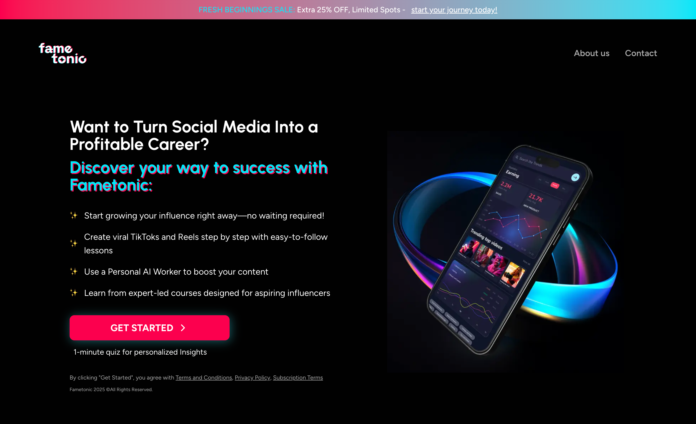

# Fametonic 🌟

Turn your social media presence into a thriving career with Fametonic - your all-in-one platform for influencer growth and monetization.



[View Live Demo](https://fametonic-open-web-m93z.vercel.app/) 

## 🚀 Features

- **Modern UI/UX**: Built with a beautiful, responsive design using Tailwind CSS
- **Performance Optimized**: Leverages Next.js 14's latest features for optimal performance
- **Typography**: Custom font implementation using Figtree and Urbanist from Google Fonts
- **Animations**: Smooth, custom animations for enhanced user experience
- **Mobile Responsive**: Fully responsive design that works on all devices
- **TypeScript**: Built with TypeScript for better type safety and developer experience

## 🛠️ Tech Stack

- **Framework**: [Next.js 14](https://nextjs.org/)
- **Styling**: [Tailwind CSS](https://tailwindcss.com/)
- **Icons**: [Lucide React](https://lucide.dev/)
- **Fonts**: Google Fonts (Figtree, Urbanist)
- **Language**: TypeScript
- **Development**: ESLint, Prettier

## 📦 Installation

1. Clone the repository:
   ```bash
   git clone https://github.com/Clintjeez/fametonic-open-web.git
   cd fametonic
   ```

2. Install dependencies:
   ```bash
   npm install
   # or
   yarn install
   ```

3. Run the development server:
   ```bash
   npm run dev
   # or
   yarn dev
   ```

4. Open [http://localhost:3000](http://localhost:3000) in your browser

## 🏗️ Project Structure

```
src/
├── app/                # Next.js app directory
│   ├── layout.tsx     # Root layout component
│   ├── page.tsx       # Home page
│   └── globals.css    # Global styles
├── components/        # Reusable components
└── styles/           # Additional styles
```

## 🚀 Deployment

The project is configured for easy deployment on Vercel:

1. Push your code to GitHub
2. Import your repository on [Vercel](https://vercel.com)
3. Deploy with a single click

## 🎨 Customization

### Fonts
The project uses two main fonts:
- **Figtree**: Primary font for body text
- **Urbanist**: Used for headings

You can modify the font configuration in `src/app/layout.tsx` and `tailwind.config.js`.

### Colors
The color scheme can be customized in `tailwind.config.js`. The current theme includes:
- Primary gradient: `#FC004E` to `#10CBE0`
- Background: `#010101`

## 🧪 Running Tests

```bash
npm run test
# or
yarn test
```

## 📝 License

This project is licensed under the MIT License - see the [LICENSE](LICENSE) file for details.

## 👥 Contributing

Contributions are welcome! Please feel free to submit a Pull Request.

1. Fork the project
2. Create your feature branch (`git checkout -b feature/AmazingFeature`)
3. Commit your changes (`git commit -m 'Add some AmazingFeature'`)
4. Push to the branch (`git push origin feature/AmazingFeature`)
5. Open a Pull Request


---

Built with ❤️ by [Clinton James]